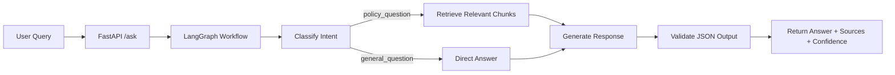

# Support Assistant — Zepto (Module 3)

**Project overview:**
- **Purpose:** Implement a small, self-contained RAG (Retrieval-Augmented Generation) service for Zepto policies that is fully deterministic in mock LLM mode (`MOCK_LLM=1`) and optionally calls a real LLM when `MOCK_LLM=0`.
- **Graded baseline:** runs entirely offline using a keyword classifier and canned/mock outputs for generation. Embeddings and retrieval run locally via `sentence-transformers` + ChromaDB.

**Quick facts:**
- **Local server:** POST `/ask` on port `7860` (FastAPI + Uvicorn).
- **ChromaDB collection:** `zepto_collection` stored under `chroma_db/`.
- **Embedding model:** `sentence-transformers/all-MiniLM-L6-v2` (local inference).

**Prerequisites**
- Python 3.10+ recommended
- A local environment with internet access for the first model download
- Optional: Docker if you want to run the app in a container

**Environment variables**
- `MOCK_LLM=1` (default) keeps the app in deterministic mock mode.
- `MOCK_LLM=0` enables the real-LLM path and requires `GROQ_API_KEY`.
- You can place these in a `.env` file at the project root.

**Project structure**
```text
support_assistant/
├── app/
│   ├── __init__.py
│   ├── embeddings.py
│   ├── graph.py
│   ├── ingest.py
│   ├── models.py
│   ├── nodes.py
│   ├── prompt.py
│   ├── retriever.py
│   └── schemas.py
├── chroma_db/
├── docs/
├── main.py
├── models_cache/
├── requirements.txt
├── Dockerfile
├── .gitignore
└── README.md
```

**RAG pipeline architecture**
1. **Document ingestion:** policy files from `docs/` are loaded by `app/ingest.py` and embedded with `sentence-transformers`.
2. **Vector storage:** embeddings are stored in ChromaDB under `chroma_db/` for similarity search.
3. **Query handling:** the FastAPI endpoint in `main.py` receives a user question and passes it to the LangGraph workflow.
4. **Intent routing:** `app/nodes.py` first classifies the question as either a policy-related query or a general question.
5. **Retrieval:** for policy questions, `app/retriever.py` searches ChromaDB and returns the most relevant document chunks.
6. **Response generation:** the app either returns a deterministic mock answer or, in real-LLM mode, uses a prompt plus retrieved context to generate a response.
7. **Output validation:** the result is validated against the Pydantic schema before being returned to the client.



**How to run (development)**
- **Step 1 — create a virtualenv and install dependencies:**

  If this is your first run, the embedding model may take a few minutes to download into `models_cache/`.

  ```bash
  python -m venv .venv
  # Windows
  .venv\Scripts\activate
  # macOS / Linux
  source .venv/bin/activate
  pip install -r requirements.txt
  ```

- **Step 2 — ingest the 8 policy documents into ChromaDB:**

  ```bash
  # Run from repository root
  python -m app.ingest
  ```

- **Step 3 — run the FastAPI app (mock mode by default):**

  ```bash
  uvicorn main:app --host 0.0.0.0 --port 7860
  ```

**API examples (mock mode — graded baseline)**
- **Policy query (retrieval expected):**

  ```bash
  curl -s -X POST http://localhost:7860/ask \
    -H "Content-Type: application/json" \
    -d '{"query":"How do I cancel my order?"}'
  ```

  Typical mock-mode JSON response:

  ```json
  {
    "answer": "Based on the retrieved context:\n\nOrder Cancellation Policy\n\nOrders can be cancelled free of cost any time before the order status changes to 'Packed', typically within the first 2 minutes of placing the order. Once an order has been ",
    "sources": ["doc_5", "doc_6", "doc_2"],
    "confidence": 1.0
  }
  ```

- **General query (no retrieval):**

  ```bash
  curl -s -X POST http://localhost:7860/ask \
    -H "Content-Type: application/json" \
    -d '{"query":"Tell me a joke."}'
  ```

  Typical mock-mode JSON response:

  ```json
  {
    "answer": "I can only answer questions about Zepto policies right now.",
    "sources": [],
    "confidence": 1.0
  }
  ```

**Verified local responses**

These were verified against the running local FastAPI server with `MOCK_LLM` left at its default value (`1`).

```json
{"query":"How do I cancel my order?"}
=>
{
  "answer": "Based on the retrieved context:\n\nOrder Cancellation Policy\n\nOrders can be cancelled free of cost any time before the order status changes to 'Packed', typically within the first 2 minutes of placing the order. Once an order has been ",
  "sources": ["doc_5", "doc_6", "doc_2"],
  "confidence": 1.0
}
```

```json
{"query":"Tell me a joke."}
=>
{
  "answer": "I can only answer questions about Zepto policies right now.",
  "sources": [],
  "confidence": 1.0
}
```

**Project structure and file-by-file explanation**
- **`app/__init__.py`**: package initializer for `app` so imports like `from app import ...` work reliably.
- **`app/graph.py`**: defines the LangGraph `StateGraph` for orchestration and routing. It wires nodes `classify_intent`, `retrieve_and_answer`, and `direct_answer` (from `app/nodes.py`) and compiles a `graph` object used by the FastAPI endpoint.
- **`app/nodes.py`**: contains the three LangGraph node implementations:
  - **`classify_intent`**: keyword heuristic in mock mode (default); optional LLM classification when `MOCK_LLM=0`.
  - **`retrieve_and_answer`**: always runs retrieval using `app/retriever.py`; in mock mode returns a deterministic canned answer based on the top retrieved chunk; in real LLM mode prompts the LLM with a structured prompt and validates JSON output.
  - **`direct_answer`**: mock mode returns a fixed canned string; real LLM mode optionally generates an answer using the structured general prompt.

- **`app/ingest.py`**: ingestion script — loads the 8 files from `docs/`, chunks (per-document), embeds with `sentence-transformers/all-MiniLM-L6-v2`, and writes vectors into a ChromaDB collection named `zepto_collection` under `chroma_db/`. It exposes `run_ingest()` and is runnable via `python -m app.ingest`.
- **`app/embeddings.py`**: loads the `SentenceTransformer` model (`all-MiniLM-L6-v2`) via `load_embedding_model()` for reuse in `ingest.py` and `retriever.py`.
- **`app/retriever.py`**: connects to the persistent ChromaDB under `chroma_db/`, embeds queries using the same model, and returns the top-k documents and their ids in a dict `{"documents": [...], "ids": [...]}`.
- **`app/prompt.py`**: contains the structured prompt templates used when calling a real LLM (`MOCK_LLM=0`). The role–context–task–format–length skeleton is implemented and includes:
  - **Negative constraint:** explicit instruction not to hallucinate (e.g., "Do not answer using information that is not present in the provided context").
  - **Few-shot example:** an example mapping `Context -> Question -> Output` that demonstrates the required JSON format.
- **`app/models.py`**: defines the `State` TypedDict used as the graph state type.
- **`app/schemas.py`**: Pydantic `RequestSchema` and `ResponseSchema` that enforce the required JSON contract: `answer: str`, `sources: list[str]`, `confidence: float`.
- **`app/graph.py`** (repeated): the compiled `graph` object is intended to be imported by `main.py` and used to `invoke()` the pipeline with incoming queries.

- **Top-level `main.py`**: FastAPI application. Exposes `POST /ask` which accepts `{"query": str}` and returns the validated `ResponseSchema` produced by `graph.invoke()`.
- **`docs/`**: contains the 8 exact policy documents (`doc_1.txt` … `doc_8.txt`) required by the assignment. These are ingested verbatim by `app/ingest.py`.
- **`chroma_db/`**: persistent ChromaDB directory (ignored in git). Holds the vector database created by the ingestion step.
- **`Dockerfile`**: builds a container image that runs the FastAPI app via `uvicorn main:app --host 0.0.0.0 --port 7860`.
- **`requirements.txt`**: Python dependencies required to run the project locally.
- **`.gitignore`**: ignores `.venv`, `__pycache__`, local DB files, and model cache.

**Mock vs Real LLM behavior**
- **Mock mode (default / graded baseline):** `MOCK_LLM` unset or `MOCK_LLM=1`. No network LLM calls are made. `classify_intent` uses a deterministic keyword heuristic; `retrieve_and_answer` returns a canned answer built from the first retrieved chunk; `direct_answer` returns a canned string. The output JSON is constructed deterministically and validated using Pydantic.
- **Real LLM path (optional):** set `MOCK_LLM=0` and provide `GROQ_API_KEY` (or change the code to another provider). The code in `app/nodes.py` contains the real-LLM branches and retry-on-validation failure logic (3 attempts). This path is optional and not required for grading.

**Docker**
- **Build locally:**

  ```bash
  docker build -t zepto-support-assistant .
  ```

- **Run container:**

  ```bash
  docker run -p 7860:7860 zepto-support-assistant
  ```

  Notes: ChromaDB and local model cache are not included in the image by default. For a production container you may want to mount `chroma_db/` and a `models_cache/` directory as volumes. Docker build/run was verified in principle via the provided `Dockerfile`; if you want to test it locally, make sure Docker Desktop or the Docker CLI is installed on your machine.

**Repository and git**
- The project root contains the `support_assistant` folder with all code and `docs/`.
- I added a `.gitignore` and made an initial commit. To push to GitHub, add a remote and push as usual:

  ```bash
  git remote add origin <your-repo-url>
  git branch -M main
  git push -u origin main
  ```

**Validation and tests performed**
- Ran `python -m app.ingest` to populate `chroma_db/` (8 documents stored).
- Executed two example queries via the LangGraph `graph.invoke()`:
  - Policy query: confirmed routing to `retrieve_and_answer`, top result from `doc_5` (Order Cancellation Policy), and deterministic mock answer.
  - General query: confirmed routing to `direct_answer` and canned response.

**Next recommended cleanups (optional)**
- Remove the `sys.path` fallback in `app/graph.py` once you always run from the repo root or as a module (`python -m app.graph`).
- For production: replace local `models_cache/` with a reproducible model download policy, and persist ChromaDB data in a mounted volume.
